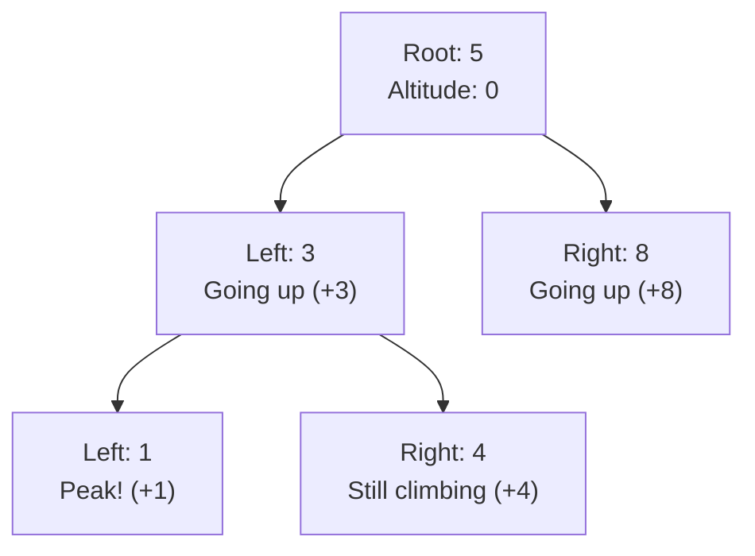
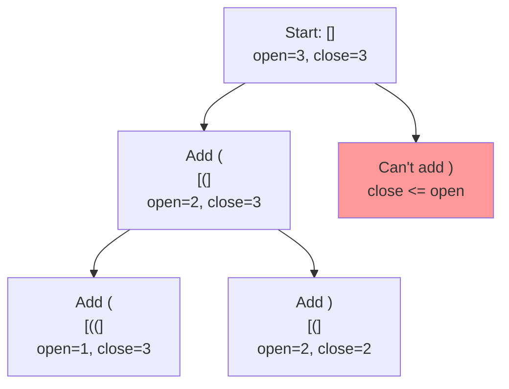
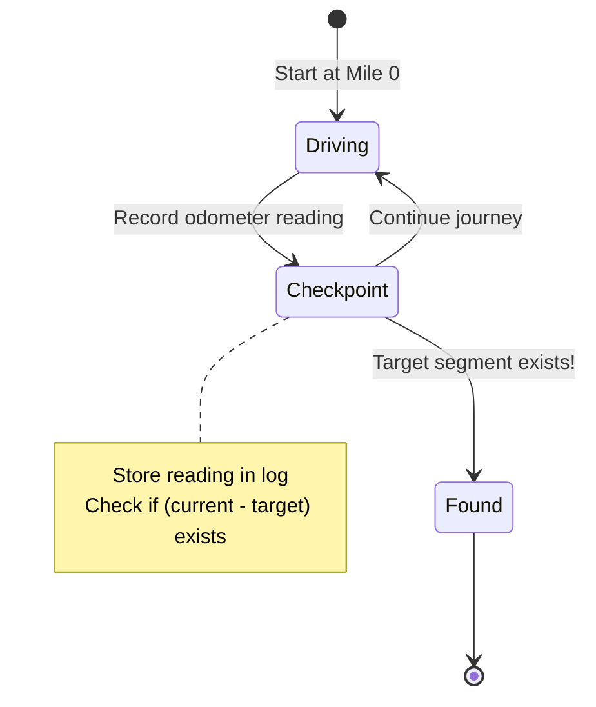
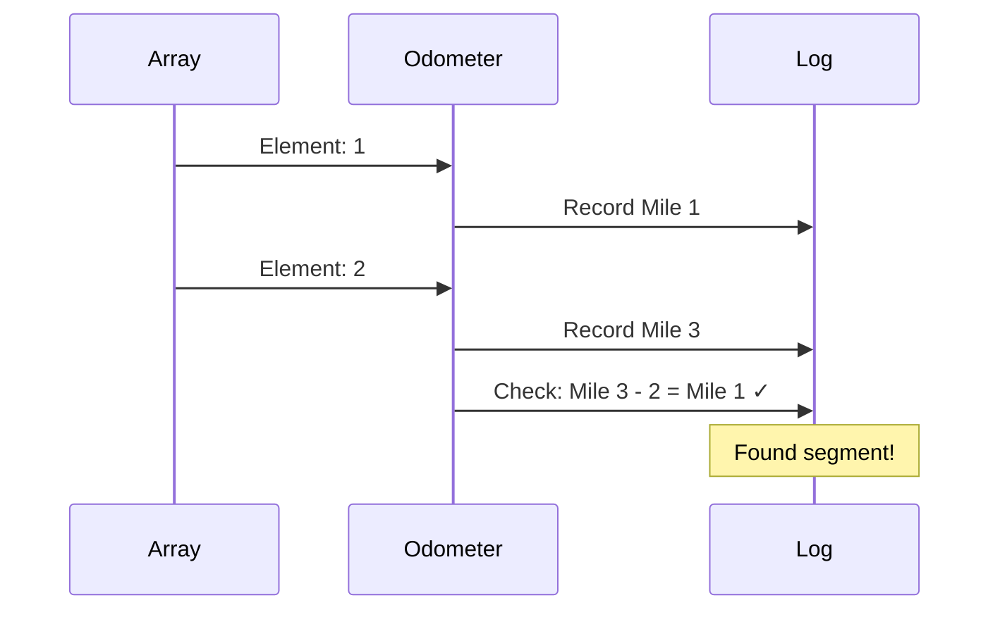

# Mental Model Building for LeetCode Problems

## Purpose
This skill creates mental model study guides that help understand algorithm concepts through **a single, powerful analogy**.

**What this skill does:**
- Builds deep understanding of the problem and solution approach
- Explains the "why" behind algorithmic choices
- Creates memorable mental models using real-world analogies
- Generates paired step files (`step1-problem.ts` + `step1-solution.ts` … `stepM-problem.ts` + `stepM-solution.ts`) and `solution.ts` that teach the concepts progressively

**What this skill does NOT do:**
- Analyze or debug existing code
- Fix bugs in implementations
- Review or critique current solutions
- Compare multiple solution approaches

## Study Guides Location
- Always create study guide directories in `./app/problems/`
- Use the format: `./app/problems/[problem-number]-[problem-name]/`

## Required Workflow
1. Choose ONE powerful analogy and commit to it
2. **Phase 1:** Write substantial analogy section explaining the mental model (NO CODE yet)
3. **Phase 2:** Build the algorithm incrementally, translating analogy concepts to code
4. Create `mental-model.md` using only that analogy throughout
5. Use mermaid charts for visualizations
6. **MUST validate all mermaid charts** using the validation script
7. Fix any validation errors before considering mental-model.md complete
8. **Create step files and solution.ts** — one `stepN-problem.ts` + `stepN-solution.ts` pair per algorithm step, plus a complete `solution.ts`; insert `:::stackblitz` directives in `mental-model.md`; add **Tracing through an Example** table, **Common Misconceptions**, and **Complete Solution** plain code block at the bottom
9. **Validate step files** — run each in order; all must exit 0; `solution.ts` must print only PASS lines
10. **Verify the problem is wired into journey.ts** — see "Step 10: Verify journey.ts" below
11. **DO NOT create README.md or any other summary documents** - only create `mental-model.md`, step files, and `solution.ts`

**Validation command:**
```bash
../../../.claude/skills/leet-mental/validate-mermaid.sh mental-model.md
```

**Step files run command:**
```bash
npx tsx step-1.ts   # Expected: TODO lines, no crashes
npx tsx solution.ts # Expected: PASS lines only
```

---

## Core Principles

1. **Choose ONE analogy and commit** - Select a single real-world metaphor and use it consistently
2. **Build the mental model FIRST** - Fully explain the analogy before introducing any code
3. **Stay in the analogy** - Never break character; keep all explanations using analogy terms
4. **Build from ground up** - Start with the simplest case, show the pattern emerging
5. **Focus on intuition, not math** - Avoid formulas and equations until after understanding
6. **Use clear visualizations** - Leverage mermaid charts and tables
7. **Explain every piece** - Never assume understanding of any component
8. **⭐ THEN BUILD CODE INCREMENTALLY** - After the mental model is solid, translate each analogy concept to code piece by piece

## Required Sections (in order)

Every mental model MUST have these seven sections in this order:

### 0. The Problem

The verbatim LeetCode problem statement followed by the provided examples. This section comes before the analogy — it anchors the reader so they know exactly what they are solving before any mental model is introduced.

Format:
- One paragraph with the exact problem description (copy it verbatim from LeetCode)
- Each example as a labeled block: **Example 1**, **Example 2**, etc., with `Input:` and `Output:` lines
- No commentary, no analysis, no analogy — just the raw problem

### 1. The [Analogy Name] Analogy (intro paragraph)

2-4 paragraphs introducing the analogy. Map each algorithm concept to a real-world counterpart. Establish the core insight. **No code.**

### 2. Understanding the Analogy

Rich, multi-paragraph prose with these named subsections:

- **The Setup** — what do we have, what are we trying to accomplish, what are the constraints? Use the analogy's vocabulary exclusively.
- **[Key mechanism name]** — explain the central data structure or technique through the analogy (e.g. "The Anchor Car", "The Three Logbooks"). Cover any critical edge case that motivates scaffolding (e.g. the dummy node, the empty container check). This may be 1-2 subsections depending on the problem.
- **Why This Approach** — why does this strategy work? What makes it efficient? What would be worse?
- **Simple Example Through the Analogy** — walk through a short concrete example using **only analogy terms** — no variable names, no TypeScript. End with: "Now you understand HOW to solve the problem. Let's build it step by step."

**This section has zero code.** It exists so the reader fully understands the solution conceptually before any implementation details appear.

### 3. How I Think Through This

**Exactly two paragraphs. No subsections. No code.**

**Paragraph 1 — Whiteboard walkthrough:** First-person prose. Start with what the problem is really asking. Name every key variable inline and say what it represents. Walk through what you set up, what decision you make at each step, and why. Call out the one rule or invariant that keeps the algorithm correct. End by stating what the final state holds. Use variable names naturally in prose but show no code blocks.

**Paragraph 2 — Concrete trace:** Open with "Tracing `[example]`:" on its own line. Then use a short bullet list — one bullet per meaningful phase (setup, each iteration, return). Each bullet names the variable and its value, states what operation happens, and shows the resulting list state. End the final bullet with the output and ✓. This breaks the trace into scannable steps rather than one wall of text.

### 4. Building the Algorithm

Each step = **concept** → **concrete example/trace** → **code sketch** → **StackBlitz embed**. Do NOT separate concepts from code into independent sections.

> ⛔ **IRON RULE: Code blocks in mental-model.md NEVER contain working implementation.**
>
> The typescript block above each `:::stackblitz` directive is a **thinking scaffold** — it shows the *shape* of the logic (pseudocode, skeleton, key comment outline) to orient the learner before they open the editor. The complete, runnable implementation lives **only** inside `stepN-solution.ts` (the Solution tab). If someone could copy your code block, paste it into the problem file, and pass the tests — you've violated this rule.
>
> ✅ Correct code block: shows structure, raises the right question, leaves the implementation blank
> ❌ Wrong code block: shows working logic the learner just has to read and understand

**What belongs in each Step:**

1. **Analogy prose** — explain the concept through the analogy. What is this step doing in the real-world metaphor? What question should the learner be asking themselves before they start coding?
2. **Concrete walk-through** — trace through a small example using analogy terms to show what this step accomplishes. Make the "why" undeniable.
3. **Code sketch** — show the *shape* of the logic: variable names, loop structure, key conditional, and `// what goes here?` comment. Leave the core logic as a comment or omit it. The learner should be able to look at this and think "I know what to do" — not "I just need to type this in."
4. **StackBlitz embed** — where the learner actually writes the code and checks against the solution.

**Examples of the code sketch distinction:**

```typescript
// ✅ GOOD — orients without solving
while (left < right) {
  // skip non-exhibits on each side
  // compare the two exhibits
  // advance both inspectors inward
}
```

```typescript
// ❌ BAD — this IS the solution, learner has nothing to figure out
while (left < right && !isAlphanumeric(s[left])) {
  left++;
}
while (left < right && !isAlphanumeric(s[right])) {
  right--;
}
if (s[left].toLowerCase() !== s[right].toLowerCase()) return false;
left++; right--;
```

### 5. Tracing through an Example

**A full-table trace of the complete algorithm on one concrete input.** This section appears after "Building the Algorithm" and gives the reader a scannable reference they can return to.

Format: a markdown table with one row per loop iteration (or meaningful phase). Columns must include every key variable, the action taken, and the resulting state. Use analogy-based column names where possible.

- Choose the most illustrative example — one with enough iterations to show all code paths (at least one duplicate hit and one new-title hit)
- Show the initial state as a "Start" row before the loop
- Show the final "Done" row with the return value
- Column headers must name the variable AND its analogy role, e.g. `Reading Hand (i)` not just `i`
- Every row must be complete — no blank cells

Example structure (two-pointer problems):

| Step | Reading Hand (i) | nums[i] | Writing Hand (k) | Last Placed (nums[k-1]) | New Title? | Action | Clean Section |
|------|---|---|---|---|---|---|---|
| Start | 1 | ... | 1 | ... | — | initialize | [...] |
| ... | | | | | | | |
| Done | — | — | k | — | — | return k | [...] |

### 6. Common Misconceptions

**3–5 bullet points** covering the mistakes learners most often make with this problem or technique. Each bullet must:

1. State the misconception as a natural-sounding wrong belief (in quotes or italics)
2. Explain concisely why it's wrong, using the analogy
3. State the correct mental model

Use the analogy vocabulary throughout — don't break to raw algorithm language.

Example structure:
```
**"[Wrong belief]"** — [Why it's wrong in 1-2 sentences using the analogy]. [Correct version.]
```

Place this section immediately after "Tracing through an Example" and before "Complete Solution".

1. Introduce the concept for this step using the analogy — elaborate on the "what" and "why" with a concrete example or diagram. Cover any edge case that belongs here.
2. Show the code for this step only (prior steps are locked in the step file).
3. Insert the `:::stackblitz` directive immediately after the code block.

After the final step, the reader has a complete working solution. If one key technique deserves deeper explanation (e.g., "the insertion trick", "the four-pointer dance"), add **one optional section** with multiple subsections — never multiple peer-level technique sections. That section must: (1) name and explain the technique, (2) show how it fits the analogy, (3) give a concrete code example. No checklists, no "ready for the solution?" prompts, no visualizing-the-N-pointers standalone sections.

### The Wrong Way

❌ **Separating concepts from code:**
```
## Building from the Ground Up

Example 1: [long conceptual walkthrough, no code]
Example 2: [another conceptual walkthrough, no code]
Example 3: [another conceptual walkthrough, no code]

## Building the Algorithm

Step 1: [code for step 1]
Step 2: [code for step 2]
Step 3: [code for step 3]
```

This splits concept from code, forcing the reader to mentally reconnect them later.

### The Right Way

✅ **Weave concept + code + embed at each step:**

```markdown
## Building the Algorithm

Each step introduces one concept from the analogy, then a StackBlitz embed to try it immediately.

### Step 1: [First Concept from the Analogy]

[Explain the concept with a concrete example and diagram. Cover the edge case that
motivates any scaffolding (e.g. the dummy node). Build the "why" before showing code.]

```typescript
// Code for step 1 only
// Prior steps don't exist yet — this is the foundation
```

:::stackblitz{file="step1-problem.ts" step=1 total=N solution="step1-solution.ts"}

### Step 2: [Second Concept from the Analogy]

[Trace through the concrete example to show how this step works. The reader already
understands step 1's code — now extend it with step 2's logic.]

```typescript
// Step 1 code already there (implied as locked)
// Step 2 adds the new logic
```

:::stackblitz{file="step2-problem.ts" step=2 total=N solution="step2-solution.ts"}

### Step N: [Final Concept]

[Close the loop — explain why the last piece is necessary. Cover any edge cases
that apply here. After this embed, the reader has a complete working solution.]

```typescript
return result;
```

:::stackblitz{file="stepN-problem.ts" step=N total=N solution="stepN-solution.ts"}

---

[Deeper dives and alternatives follow here — they ANCHOR on the mental model above,
not replace it. E.g. "Now that you have the working solution, here's why the
insertion trick is cleverer than the classic two-pointer reversal..."]
```

### The Woven Pattern

Each step = **concept** → **concrete example/trace** → **code** → **StackBlitz embed**

By the end of the final embed, the reader has a complete working solution. The deeper dives and alternative approaches that follow should always anchor back to the mental model already established — they enrich understanding rather than replace it.

### Structure Template

```markdown
# [Problem Name] - Mental Model

## The Problem

[Verbatim LeetCode problem description — one paragraph, copy exactly as written.]

**Example 1:**
```
Input: [input values]
Output: [expected output]
```

**Example 2:**
```
Input: [input values]
Output: [expected output]
```

---

## The [Single Analogy Name] Analogy

[2-4 paragraphs introducing the analogy. Map each algorithm concept to a real-world
counterpart. Establish the core insight. NO CODE.]

---

## Understanding the Analogy

### The Setup

[What do we have? What are we trying to accomplish? What are the constraints?
Use analogy vocabulary exclusively — no variable names, no TypeScript.]

### [Key Mechanism — e.g. "The Anchor Car", "The Three Logbooks"]

[Explain the central technique or data structure through the analogy.
Cover the critical edge case that motivates any scaffolding (dummy node, etc.).]

### Why This Approach

[Why does this strategy work? What would be worse? What makes it efficient?]

### Simple Example Through the Analogy

[Walk through a short concrete example using ONLY analogy terms.]

Now you understand HOW to solve the problem. Let's build it step by step.

---

## How I Think Through This

[Paragraph 1 — First-person whiteboard walkthrough. Name every key variable inline,
call out the core rule/invariant, explain why the approach works. NO CODE BLOCKS.]

[Paragraph 2 — Concrete trace. Open with "Take `[example]`." Narrate each step,
naming variable values. End with final output and ✓.]

---

## Building the Algorithm

Each step introduces one concept from the [analogy name], then a StackBlitz embed to try it.

### Step 1: [First Concept]

[Explain this step's concept through the analogy. What is the learner setting up, and why?
Walk through how it applies to a small concrete example using analogy terms.
Raise the question the learner should answer before opening the editor.]

```typescript
// SKETCH ONLY — no working implementation here
// set up [analogy role of variable]
// return [what step 1 alone produces and why]
```

:::stackblitz{file="step1-problem.ts" step=1 total=N solution="step1-solution.ts"}

### Step 2: [Second Concept]

[Trace through the concrete example to show what this step adds. The reader already
has step 1 internalized — now: what new decision does this step make, and when?
Use the analogy to make the condition or loop feel inevitable, not arbitrary.]

```typescript
// SKETCH ONLY — no working implementation here
while ([analogy condition]) {
  // [what each inspector / pointer does and why]
}
// [what both pointers now guarantee before the next step]
```

:::stackblitz{file="step2-problem.ts" step=2 total=N solution="step2-solution.ts"}

### Step N: [Final Concept]

[Close the loop. What does this last step decide, and what happens if it's missing?
After the StackBlitz embed the learner has a complete working solution.]

```typescript
// SKETCH ONLY — no working implementation here
// compare / combine / return — [what the final answer represents in analogy terms]
```

:::stackblitz{file="stepN-problem.ts" step=N total=N solution="stepN-solution.ts"}

---

## [Optional: The [Key Technique Name]]

**Use this section only when one technique needs more explanation than the algorithm steps provide.**
This should be a SINGLE section — never multiple peer-level technique sections.

### What It Is

[Name the technique and explain it concisely. Stay in the analogy vocabulary.]

### How It Fits the Analogy

[Show explicitly how this technique maps to the analogy. Use concrete values from your running example.]

### The Code

```typescript
// Focused code example showing just this technique
// Annotate with analogy terms
```

---

## Tracing through an Example

| Step | [Reading Hand var] | [value] | [Writing Hand var] | [Last Placed] | New Title? | Action | [State] |
|------|---|---|---|---|---|---|---|
| Start | 1 | ... | 1 | ... | — | initialize | [...] |
| ... | | | | | | | |
| Done | — | — | k | — | — | return k | [...] |

---

## Common Misconceptions

**"[First wrong belief]"** — [Why it's wrong using the analogy. What the correct mental model is.]

**"[Second wrong belief]"** — [Why it's wrong using the analogy. What the correct mental model is.]

**"[Third wrong belief]"** — [Why it's wrong using the analogy. What the correct mental model is.]

---

## Complete Solution

:::stackblitz{file="solution.ts" step=N total=N solution="solution.ts"}
```

### Visualization Guidelines

**USE MERMAID CHARTS FOR:**
- Tree/graph structures (binary trees, graphs, decision trees)
- Flow diagrams showing algorithm progression
- State transitions and recursion paths
- Sequence of operations over time

**USE TABLES FOR:**
- State changes across steps with multiple variables
- Comparison of values at different stages
- Lookup tables and mappings

**Mermaid Chart Best Practices:**
- Always validate chart syntax before considering them complete
- Label nodes with concrete values from your example (not abstract variables)
- Use analogy-based labels (e.g., "Mile 70" instead of "sum=70")
- Keep hierarchy clear with proper indentation
- Include legend or key when needed

**DON'T:**
- Don't use abstract variable names in diagrams
- Don't skip showing intermediate states
- Don't create charts without validating them first

### Mermaid Chart Examples by Problem Type

**Binary Tree Problems:**


**Backtracking/Decision Trees:**


**State Machine/Flow:**


**Sequence/Timeline:**


### Validating Mermaid Charts

**CRITICAL: Always validate charts before completion**

After creating a mental model with mermaid charts, you MUST validate them:

```bash
# Run the validation script on your mental-model.md file
../../../.claude/skills/leet-mental/validate-mermaid.sh mental-model.md
```

The script will:
1. Extract all mermaid blocks from the markdown file
2. Validate basic syntax (diagram type, structure, common errors)
3. Report which charts pass syntax validation
4. Exit with error code if any chart has syntax errors

**Validation workflow:**
1. Create mental-model.md with mermaid charts
2. Run validation script
3. If errors found: fix the mermaid syntax and re-run
4. Only consider the file complete when all charts pass validation

**Note:** This performs basic syntax validation without rendering. Charts should still be visually verified in GitHub, Obsidian, or other markdown viewers.

### Example: Good vs Bad Explanations

**❌ BAD:**
```
We check if (current_sum - k) exists in the hashmap.
If it does, we found a subarray.
```

**✅ GOOD:**
```
Imagine your car's odometer shows 100 miles.
If you want to find when you drove exactly 30 miles,
you look in your logbook for when the odometer read 70.
The segment between 70 and 100 is exactly 30 miles!
```

### Choosing Your Single Analogy

**CRITICAL: Pick ONE analogy and commit to it completely.**

Don't mix analogies. Don't switch metaphors mid-explanation. The power comes from consistency.

#### Proven Analogies by Problem Type

**Subarray Sum Problems:**
- **Odometer journey** (running sums = cumulative distances traveled)
  - Why it works: Segments between checkpoints = subarrays
  - Natural fit for prefix sums, looking back at previous readings

**Tree Problems:**
- **Mountain climbing** (going up to children, down to parent)
  - Why it works: Height/altitude maps to depth, peaks = leaves
  - Natural fit for DFS, path concepts

**Backtracking:**
- **Maze exploration** (try paths, hit walls, backtrack)
  - Why it works: Dead ends = invalid states, retracing steps = backtracking
  - Natural fit for constraint checking, state restoration

**Graph Problems:**
- **City/road map** (cities = nodes, roads = edges)
  - Why it works: Distance, connectivity, paths all intuitive
  - Natural fit for BFS/DFS, shortest path

**Selection criteria:**
- Does every algorithm concept have a natural real-world parallel?
- Do edge cases make sense in the analogy?
- Will someone remember this analogy weeks later?
- Can you explain the entire solution without leaving the analogy?

**Reinforcement rule:** Once you pick the analogy, every example, trace, visualization label, variable name, and misconception must be expressed through that same analogy. Repetition of the analogy across different examples is what makes it stick. The reader should never encounter a second metaphor — if they do, the analogy wasn't strong enough and you should rework it rather than introduce another.

### Variable Naming in Solutions

When implementing with the analogy:
- Use analogy-based names: `odoLog`, `milesDriven`, `segmentsFound`
- Avoid generic names: `map`, `sum`, `count`
- Make the connection to mental model obvious

**Example:**
```typescript
// ✅ GOOD - Uses analogy
const odoLog = new Map();
let milesDriven = 0;
const targetReading = milesDriven - k;

// ❌ BAD - Generic
const map = new Map();
let sum = 0;
const target = sum - k;
```

### Testing Your Mental Model

Before considering a mental model complete, verify all four required sections are present and correct:

**Section 1 — The Analogy Intro**
1. Does it establish the analogy in 2-4 paragraphs with no code?
2. Are all key algorithm concepts mapped to analogy counterparts?

**Section 2 — Understanding the Analogy**
3. Does it have named subsections: The Setup, [Key Mechanism], Why This Approach, Simple Example?
4. Is the Setup written purely in analogy terms — no variable names, no TypeScript?
5. Does it cover the critical edge case (if any) within the analogy explanation?
6. Does the Simple Example walk through using ONLY analogy terms?
7. Does it end with "Now you understand HOW to solve the problem. Let's build it step by step."?

**Section 3 — How I Think Through This**
8. Does Paragraph 1 name key variables inline, call out the core rule/invariant, and explain why — all in prose with no code blocks?
9. Does Paragraph 2 open with "Take `[...]`." and narrate each step with variable values, ending with the output and ✓?
10. Could you read both paragraphs, close your laptop, and reconstruct the algorithm on a whiteboard?

**Section 4 — Building the Algorithm (Woven Steps)**
11. Does each step weave concept + example/trace + code sketch + StackBlitz embed together (not separated)?
12. Is the :::stackblitz directive placed immediately after the code block for each step?
13. By the final step, does the reader have a complete working solution?
14. **Code sketch check (CRITICAL):** For every code block above a `:::stackblitz` — could a learner copy it, paste it into the problem file, and pass the tests? If yes, it's implementation code, not a sketch. Replace the working logic with comments or pseudocode that convey the *shape* without giving away the answer.

**Section 5 — Tracing through an Example**
14. Is there a markdown table with one row per loop iteration (or meaningful phase)?
15. Does every column name include the variable AND its analogy role (e.g. `Reading Hand (i)` not just `i`)?
16. Are all code paths represented — at least one duplicate hit and one new-title hit?
17. Is there a "Start" row (initial state) and a "Done" row (return value)?

**Section 6 — Common Misconceptions**
18. Are there 3–5 misconceptions, each stated as a natural-sounding wrong belief?
19. Is each explained using the analogy (not raw algorithm language)?
20. Does each end with the correct mental model?

**Complete Solution**
21. Does the Complete Solution use `:::stackblitz{file="solution.ts" step=M total=M solution="solution.ts"}` (same file and solution value so tabs are hidden)?

**Overall**
22. **Single analogy throughout:** No secondary metaphors, no "it's also like..."
23. **Reinforcement:** Every example deepens comfort with the ONE analogy
24. **No code analysis:** Avoid debugging or reviewing existing code

**The ultimate test:** Can someone read the analogy section, fully understand the approach without seeing any code, and then easily follow the code section because they already have the mental model?

### What to Avoid

**Never do these:**
- ❌ Analyzing or debugging existing code implementations
- ❌ Fixing bugs in current solutions
- ❌ Reviewing code quality or suggesting refactors
- ❌ **Separating concepts from code** — don't write "Building from the Ground Up" (conceptual) as a standalone section followed by a separate "Building the Algorithm" (code) section; weave them together at each step
- ❌ **Jumping into code before establishing the analogy** — the analogy intro section must come first, before any steps
- ❌ Mixing multiple analogies or switching metaphors mid-explanation
- ❌ Introducing a second analogy to "clarify" the first — if the first analogy needs help, replace it with a better one
- ❌ Starting with "The algorithm does X" instead of analogy
- ❌ Breaking out of the analogy to use technical terms in the analogy section
- ❌ Using mathematical notation before building intuition
- ❌ Comparing multiple solution approaches (focus on understanding ONE way)
- ❌ Assuming knowledge of data structures (explain why through analogy)
- ❌ Skipping the "why this exists" for each component
- ❌ Using confusing phrasing like "subtract an old running total"
- ❌ Missing the progression from simple to complex examples
- ❌ Generic variable names (use analogy-based names always)
- ❌ Dumping complete code at the end instead of building it incrementally
- ❌ **Not having a clear break between "understanding the analogy" and "building the code"**
- ❌ **Filling in the TODO in any problem file** — each `stepN-problem.ts` body must throw `new Error('not implemented')` until the learner implements it; only `stepN-solution.ts` and `solution.ts` have working code
- ❌ **Calling a void/in-place function outside the test thunk** — if the function mutates in-place and returns void, the setup (build input) and mutation call must live inside `() => { ... return result }` so that `Error('not implemented')` is caught and prints `TODO` instead of crashing the process
- ❌ **Showing working solution code in mental-model.md code blocks** — this is the single most common mistake; code blocks above `:::stackblitz` directives must be SKETCHES only (pseudocode, commented structure, shape of the logic). If a learner could copy your code block and pass the tests, you wrote implementation code instead of a sketch. The full working code lives exclusively in `stepN-solution.ts` and `solution.ts`.
- ❌ **Multiple peer-level technique sections** after the algorithm steps — if you need deeper explanation, use ONE section with subsections (what it is, how it fits the analogy, code), not separate `## The Reversal Technique`, `## The Four-Pointer Technique`, `## Visualizing the Four Pointers`, etc.
- ❌ **Checklists, "Ready for the Solution?" prompts, or "The Mental Model Checklist" sections** — these add no pedagogical value and dilute the analogy

**Remember:**
- First: Build the mental model through the analogy (NO CODE)
- Then: Translate that mental model to code piece by piece

---

## Step 8: Create step files and solution.ts

After completing `mental-model.md`, count the `### Step N:` subsections in the "Building the Algorithm" section. For a guide with M steps, generate **paired files** `step1-problem.ts` + `step1-solution.ts` through `stepM-problem.ts` + `stepM-solution.ts`, plus a complete `solution.ts`.

### File naming convention

| File | Purpose |
|------|---------|
| `stepN-problem.ts` | Step N starter — function body throws `Error('not implemented')`, cumulative tests |
| `stepN-solution.ts` | Step N solution — function body fully implemented, all tests pass |
| `solution.ts` | Complete solution with all steps — every test passes |

Each file in a pair is **fully self-contained** (no imports, no top-level async).

### stepN-problem.ts structure

1. **Header comment** — states the step goal in one sentence from the analogy
2. **Function + tests** — the function to implement (with prior steps locked inside the body), then tests immediately after
3. **Helpers sentinel + boilerplate** — `// ─── Helpers ───` divider, then data structures (`ListNode`, etc.) and utility functions at the bottom

The editor auto-folds everything below `// ─── Helpers ───`, so the learner sees only the function and tests. The helpers must still be present for the file to run.

The test helper uses a **thunk form** to catch `Error('not implemented')` during the call, not just during comparison:

```typescript
function test(desc: string, fn: () => unknown, expected: unknown): void {
  try {
    const actual = fn();
    const pass = JSON.stringify(actual) === JSON.stringify(expected);
    console.log(`${pass ? 'PASS' : 'FAIL'} ${desc}`);
    if (!pass) {
      console.log(`  expected: ${JSON.stringify(expected)}`);
      console.log(`  received: ${JSON.stringify(actual)}`);
    }
  } catch (e) {
    if (e instanceof Error && e.message === 'not implemented') {
      console.log(`TODO  ${desc}`);
    } else {
      throw e;
    }
  }
}
```

### stepN-problem.ts template

```typescript
// =============================================================================
// {Problem Name} — Step N of M: {Step Title}
// =============================================================================
// Goal: {one sentence from the analogy describing what this step accomplishes}
//
// Prior steps are complete and locked inside the function body.

function solveProblem(...): ReturnType {
  // ✓ Step 1: {what step 1 does} (locked)
  // ... step 1 code inlined and working ...

  // ✓ Step N-1: {what prior step does} (locked)
  // ...

  throw new Error('not implemented');
}

// Tests
test('{desc}', () => solveProblem(input), expected);
test('{desc}', () => solveProblem(input), expected);
```

**In-place / void functions**: if the problem mutates a data structure and returns `void` (e.g. reverse a list in-place), the mutation call MUST happen inside the thunk — never outside it. Calling it outside means `throw new Error('not implemented')` propagates uncaught, crashing the process instead of printing `TODO`.

```typescript
// ❌ WRONG — crashes when function is unimplemented
const list = createList([1, 2, 3]);
reverseList(list);
test('basic reverse', () => listToArray(list), [3, 2, 1]);

// ✅ CORRECT — mutation inside thunk, throw is caught
test('basic reverse', () => {
  const list = createList([1, 2, 3]);
  reverseList(list);
  return listToArray(list);
}, [3, 2, 1]);
```

```typescript

// ─── Helpers ──────────────────────────────────────────────────────────────────
// (auto-folded in the editor — must be present for the file to run)

class ListNode {  // or TreeNode, etc.
  val: number;
  next: ListNode | null;
  constructor(val = 0, next: ListNode | null = null) {
    this.val = val;
    this.next = next;
  }
}

function createList(values: number[]): ListNode | null {
  const dummy = new ListNode();
  let cur = dummy;
  for (const v of values) { cur.next = new ListNode(v); cur = cur.next; }
  return dummy.next;
}

function listToArray(head: ListNode | null): number[] {
  const r: number[] = [];
  let cur = head;
  while (cur) { r.push(cur.val); cur = cur.next; }
  return r;
}

function test(desc: string, fn: () => unknown, expected: unknown): void {
  try {
    const actual = fn();
    const pass = JSON.stringify(actual) === JSON.stringify(expected);
    console.log(`${pass ? 'PASS' : 'FAIL'} ${desc}`);
    if (!pass) {
      console.log(`  expected: ${JSON.stringify(expected)}`);
      console.log(`  received: ${JSON.stringify(actual)}`);
    }
  } catch (e) {
    if (e instanceof Error && e.message === 'not implemented') {
      console.log(`TODO  ${desc}`);
    } else { throw e; }
  }
}
```

### stepN-solution.ts template

Identical layout to `stepN-problem.ts` but the function body is **fully implemented** and all tests must print PASS. No TODO comments. Add inline comments referencing the analogy on non-trivial lines.

```typescript
// =============================================================================
// {Problem Name} — Step N of M: {Step Title} — SOLUTION
// =============================================================================
// Goal: {one sentence from the analogy}

function solveProblem(...): ReturnType {
  // ✓ Step 1: {analogy term} — {one-line explanation}
  // ... step 1 code ...

  // Step N: {analogy term} — {one-line explanation}
  // ... step N implementation ...
}

// Tests — all must print PASS
test('{desc}', () => solveProblem(input), expected);
test('{desc}', () => solveProblem(input), expected);

// ─── Helpers ──────────────────────────────────────────────────────────────────
// (identical to problem file)
class ListNode { ... }
function createList(...) { ... }
function listToArray(...) { ... }
function test(...) { ... }
```

### solution.ts file structure

Complete implementation with all M steps. Every test must print PASS. Add inline comments on each non-trivial line referencing the analogy.

```typescript
// =============================================================================
// {Problem Name} — Complete Solution
// =============================================================================

function solveProblem(...): ReturnType {
  // All steps implemented
}

// Tests — all must print PASS
test('{desc}', () => ..., expected);

// ─── Helpers ──────────────────────────────────────────────────────────────────
class ListNode { ... }
function createList(...) { ... }
function listToArray(...) { ... }
function test(...) { ... }
```

### Insert :::stackblitz directives in mental-model.md

**Placement is critical:** The "Building the Algorithm" section (with its `### Step N:` subsections) must appear **inline in the natural narrative flow** — immediately after the introductory analogy sections end, **not appended at the bottom** of the file.

After each `### Step N:` code block, insert this directive on its own line with a blank line before and after:

```
:::stackblitz{file="stepN-problem.ts" step=N total=M solution="stepN-solution.ts"}
```

Where M is the total number of algorithm steps. The directive must match this format exactly — the MarkdownRenderer regex requires fixed attribute order and quoted file/solution values.

**At the very bottom of mental-model.md**, after Common Misconceptions, add the complete solution as a runnable StackBlitz embed. Use `solution.ts` for both `file` and `solution` — the component detects this and hides the Try It / Solution tabs, showing a single runnable editor:

```markdown
## Complete Solution

:::stackblitz{file="solution.ts" step=M total=M solution="solution.ts"}
```

---

## Step 9: Validate step files

Run each step file in order from the problem directory. All must exit 0. Unimplemented TODOs will print `TODO` — that is expected. `solution.ts` must print only `PASS` lines.

```bash
cd app/problems/{id}-{slug}/

npx tsx step1-problem.ts    # Expected: TODO lines, no crashes
npx tsx step1-solution.ts   # Expected: PASS lines only (for step 1 tests)
npx tsx step2-problem.ts    # Expected: TODO lines, no crashes
npx tsx step2-solution.ts   # Expected: PASS lines only (for step 1+2 tests)
# repeat for each step pair
npx tsx solution.ts         # Expected: PASS lines only
```

If any file exits non-zero (TypeScript/syntax error, or test failure in solution.ts), fix it before proceeding.

**Step 10 (journey.ts verification) is unchanged.**

---

## Step 10: Verify journey.ts

After the step files validate, verify the problem is wired into the learning path:

1. Read `./lib/journey.ts`
2. Search every section's `firstPass` and `reinforce` arrays for `{ id: '{problemId}', ...}`
   - Problem ID = the zero-padded number (e.g., `'026'`, `'076'`)
3. **If found**: confirm with "✓ Problem {id} is in the learning path under [{section.label}]" — no edit needed, `content.ts` auto-discovers the mental model from disk
4. **If NOT found**: the problem isn't in the journey yet
   - Re-read `./00-complete-dsa-path.md` and locate which step/section the problem belongs to
   - Match that step's name to the corresponding `section.label` in `journey.ts`
   - Determine tier: if listed under **Practice** in the DSA path → add to `firstPass`; if under **Revisit** → add to `reinforce`
   - Use the Edit tool to append the entry to the correct array:
     - `firstPass`: `{ id: '{id}', isFirstPass: true },`
     - `reinforce`: `{ id: '{id}', isFirstPass: false },`
   - Confirm the edit with the section it was added to

---

### Reference Examples

**Excellent mental models (read these to match the tone):**
- `./app/problems/022-generate-parentheses/mental-model.md`
  - Uses mountain climbing analogy
  - Builds from n=1 to n=3
  - Explains constraints naturally

- `./app/problems/560-subarray-sum-equals-k/mental-model.md`
  - Uses odometer/checkpoint analogy
  - Shows why hashmap stores counts
  - Traces duplicate readings clearly
