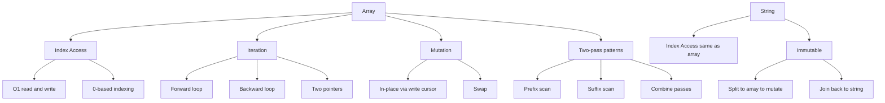
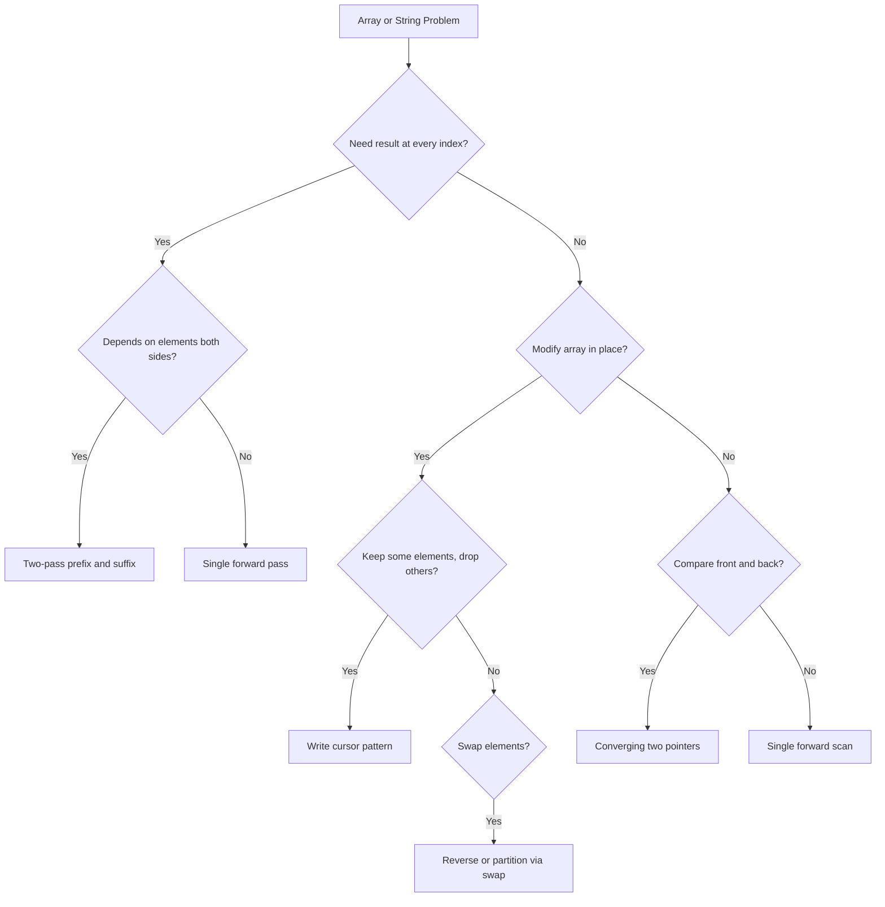

# Arrays & Strings - Fundamentals

## 1. Overview

Arrays and strings are the most fundamental data structures in programming — a contiguous sequence of elements accessed by numeric index. Nearly every other algorithm touches them, which is exactly why they come first: comfort here means you can focus on the technique, not the data structure.

You already know how to loop over an array. This guide deepens that: you'll learn how to use indexes as tools — not just counters — to manipulate data in place, read from both ends simultaneously, and make multiple passes when one isn't enough.

The three building blocks progress from single-index iteration → two-index write cursor → two-index convergence. Each level unlocks a new class of problems.

---

## 2. Core Concept & Mental Model

### The Tape Analogy

Think of an array as a **cassette tape**:
- **Cells** = frames on the tape — each holds one value, has one address (index)
- **Index** = the read/write head position — you control where it points
- **In-place** = recording over existing frames without buying a new tape
- **String** = a read-only tape — you can read any frame, but you can't erase or overwrite (strings are immutable; modifications require creating a new tape)

Unlike a linked list, where you follow chains of pointers, any cell on the tape is reachable in O(1) — you just say "go to position 7." This random access is what makes index manipulation so powerful.

### Concept Map



### Key Operations

| Operation           | Array  | String (JS/TS)     |
| ------------------- | ------ | ------------------ |
| Read at index       | O(1)   | O(1)               |
| Write at index      | O(1)   | ❌ immutable        |
| Push / pop          | O(1)   | O(n) — new string  |
| Reverse in-place    | O(n)   | O(n) — needs split |
| Contains (linear)   | O(n)   | O(n)               |
| Slice               | O(k)   | O(k)               |

---

## 3. Building Blocks — Progressive Learning

### Level 1: Index Manipulation & Linear Iteration

**Why this level matters**
Every array algorithm is built on one primitive: *look at a cell, decide what to do, move the head.* Before you can write a two-pointer solution or a prefix-product pass, you need fluency with the basic loop — controlling exactly which index you visit and in what order.

**How to think about it**
The default `for...of` loop hides the index. That's fine for printing. It's not enough when the *position* matters — when you need to know you're at the last element, or you need to read forward and write to a different position, or you need to walk backward.

Think of iteration as *moving the tape head manually*. You control the starting position, the direction, and the stopping condition. A `for` loop with an explicit index variable is just that: you're the operator deciding where the head points each step.

Two directions matter immediately: **forward** (left → right, index 0 to n-1) and **backward** (right → left, index n-1 to 0). Reversing an array is just: simultaneously walk one head forward and one head backward, swapping as you go. The trick is stopping in the middle — once the heads cross, every pair has already been swapped.

**Walking through it**

Reverse `[1, 2, 3, 4, 5]` in place. Use a left pointer starting at 0 and a right pointer starting at 4.

```
Initial:  [1, 2, 3, 4, 5]   left=0, right=4
Swap 1↔5: [5, 2, 3, 4, 1]   left=1, right=3
Swap 2↔4: [5, 4, 3, 2, 1]   left=2, right=2
left >= right → stop
```

Three swaps for five elements. If you run one more step, you'd swap index 2 with itself — no harm but unnecessary. The condition `left < right` stops exactly in time.

**The one thing to get right**
The loop condition is `left < right`, not `left <= right`. When `left === right` on an odd-length array, that's the middle element — it doesn't need swapping. If you use `<=`, the middle element swaps with itself (harmless but wasteful); on even-length arrays, it'll swap elements that were already in their final positions.

```typescript
function reverse(arr: number[]): number[] {
  let left = 0;
  let right = arr.length - 1;
  while (left < right) {
    [arr[left], arr[right]] = [arr[right], arr[left]];
    left++;
    right--;
  }
  return arr;
}
```

> **Mental anchor**: "Two heads on the same tape — move them toward each other, stop before they cross."

**→ Bridge to Level 2**: Swapping works when every element stays in the array. But many problems ask you to *remove* elements in place — compact the array by dropping some values. A swap-based approach would leave gaps. You need a different tool: a write cursor.

---

### Level 2: The Write Cursor — In-Place Compaction

**Why this level matters**
Problems like "remove duplicates" or "remove element" ask you to shrink an array without creating a new one. You can't delete cells in an array — you can only overwrite them. The write cursor pattern is how you do it: one pointer reads every element, another pointer tracks the "next available slot" to write into.

**How to think about it**
Imagine the tape again, but now you have two heads: a **read head** that scans forward through every frame, and a **write head** that only advances when it places a keeper. The read head sees everything. The write head is picky — it moves forward only when it writes a value that belongs.

At the end, the first `writeIdx` positions of the array contain your answer. The content beyond `writeIdx` is irrelevant — the caller only looks at the first `writeIdx` elements.

This pattern appears in three guises in Step 1:
- Remove all occurrences of a value (LeetCode 27 — Remove Element)
- Remove duplicates from a sorted array (LeetCode 26 — the sorted property lets you compare with the previous written value)
- Merge two sorted arrays from the back (LeetCode 88 — runs the heads right-to-left)

**Walking through it**

Remove duplicates from `[1, 1, 2, 3, 3]`. After each step, `k` is the write head (next available slot):

```
arr = [1, 1, 2, 3, 3]   k=1 (k starts at 1: first element always kept)
read=1: arr[1]=1, arr[k-1]=1 — duplicate, skip
read=2: arr[2]=2, arr[k-1]=1 — new value, write arr[k]=2, k=2
read=3: arr[3]=3, arr[k-1]=2 — new value, write arr[k]=3, k=3
read=4: arr[4]=3, arr[k-1]=3 — duplicate, skip
```

Final: `arr = [1, 2, 3, ...]`, return `k=3`. First 3 elements are the answer.

**The one thing to get right**
For sorted deduplication, compare `arr[read]` with `arr[k-1]` — the last value you *wrote* — not with `arr[read-1]`. The read head may have skipped several duplicates since the last write; comparing with the read head's previous position would miss cases.

```typescript
function removeDuplicates(nums: number[]): number {
  let k = 1;
  for (let read = 1; read < nums.length; read++) {
    if (nums[read] !== nums[k - 1]) {
      nums[k] = nums[read];
      k++;
    }
  }
  return k;
}
```

> **Mental anchor**: "Read head scans everything. Write head only moves when it keeps something."

**→ Bridge to Level 3**: The write cursor moves in one direction. But some problems need you to check something at both ends simultaneously — like verifying a palindrome, or merging from the back. Level 3 brings both pointers together, converging from opposite ends.

---

### Level 3: Two-Pointer Convergence — Reading from Both Ends

**Why this level matters**
Some array and string properties involve comparing or combining the front and back — a palindrome compares the first character to the last, the second to the second-last, and so on. A single forward pass can't do this; you'd have to index from both ends at once. The converging two-pointer technique is the tool.

**How to think about it**
You place one pointer at the leftmost position and another at the rightmost, then walk them toward each other. At each step, you examine what both pointers see and decide: are they a valid pair? If not, you've found a mismatch and can stop early. If they match, advance both inward.

For palindrome checking on a string: left starts at 0, right starts at `s.length - 1`. Valid Palindrome (LeetCode 125) adds one twist — skip non-alphanumeric characters. So the pointers don't advance by 1 every step; they advance until they land on a valid character.

**Walking through it**

Check if `"A man, a plan, a canal: Panama"` is a palindrome. Lowercase and skip non-alphanum:

```
Cleaned view: "amanaplanacanalpanama"
left=0  ('a'),  right=19 ('a') — match, advance
left=1  ('m'),  right=18 ('m') — match, advance
left=2  ('a'),  right=17 ('a') — match, advance
left=3  ('n'),  right=16 ('n') — match, advance
...
left=9  ('a'),  right=10 ('a') — match, advance
left >= right → done, it's a palindrome
```

The actual code skips non-alphanum by advancing the pointer in a small inner loop before comparing.

**The one thing to get right**
Normalize *before* comparing. If you compare raw characters from the original string and some are uppercase or punctuation, your equality check fails on valid palindromes. Convert to lowercase and check `isAlphanumeric` at the same time — do it inside the same while loop before the comparison, not in a separate pass.

```typescript
function isPalindrome(s: string): boolean {
  let left = 0;
  let right = s.length - 1;

  while (left < right) {
    while (left < right && !isAlphanumeric(s[left])) left++;
    while (left < right && !isAlphanumeric(s[right])) right--;

    if (s[left].toLowerCase() !== s[right].toLowerCase()) return false;
    left++;
    right--;
  }
  return true;
}

function isAlphanumeric(c: string): boolean {
  return /[a-zA-Z0-9]/.test(c);
}
```

> **Mental anchor**: "Two heads walking toward each other — stop when they meet or find a mismatch."

---

## 4. Key Patterns

### Pattern: Two-Pass Prefix & Suffix Products

**When to use**: The problem asks for a result at each index that depends on *everything except* that index — and division is forbidden or the input contains zeros. Keywords: "product of array except self", "running total excluding current", "left product × right product."

**How to think about it**
One pass isn't enough because at index `i`, you need values from both sides — the product of everything to the left and everything to the right. A single loop can accumulate in only one direction at a time. The insight: do it in two passes. First pass (left → right) fills each slot with the running product of everything to its left. Second pass (right → left) multiplies in the running product of everything to its right. The two passes together give you the product of everything except `nums[i]`.

No division needed. The two independent products are computed, stored, and multiplied — no element is ever divided back out.

```typescript
function productExceptSelf(nums: number[]): number[] {
  const n = nums.length;
  const result = new Array(n).fill(1);

  // First pass: result[i] = product of all elements to the LEFT of i
  let leftProduct = 1;
  for (let i = 0; i < n; i++) {
    result[i] = leftProduct;
    leftProduct *= nums[i];
  }

  // Second pass: multiply in product of all elements to the RIGHT of i
  let rightProduct = 1;
  for (let i = n - 1; i >= 0; i--) {
    result[i] *= rightProduct;
    rightProduct *= nums[i];
  }

  return result;
}
```

**Complexity**: Time O(n), Space O(1) extra (output array doesn't count).

> See the full mental model: [238. Product of Array Except Self](../problems/238-product-of-array-except-self/mental-model.md)

---

### Pattern: Length-Prefixed Encoding

**When to use**: You need to serialize a list of strings into a single string and decode it back — losslessly, even if the strings contain any characters including the delimiter. Keywords: "encode", "decode", "serialize list of strings", "round-trip."

**How to think about it**
The naive approach uses a delimiter like `","`. It fails the moment a string *contains* that delimiter. The fix: store the length of each string before the string itself. When decoding, read the length first, then read exactly that many characters — no ambiguity about where one string ends and the next begins.

The format: `"4#word3#the5#hello"` — each chunk is `{length}#{string}`. The decoder scans for `#`, reads the number before it, then slices exactly that many characters after it.

```typescript
function encode(strs: string[]): string {
  return strs.map(s => `${s.length}#${s}`).join('');
}

function decode(s: string): string[] {
  const result: string[] = [];
  let i = 0;
  while (i < s.length) {
    const j = s.indexOf('#', i);
    const len = parseInt(s.slice(i, j));
    result.push(s.slice(j + 1, j + 1 + len));
    i = j + 1 + len;
  }
  return result;
}
```

**Complexity**: Time O(n) encode and decode, Space O(n).

> See the full mental model: [271. Encode and Decode Strings](../problems/271-encode-and-decode-strings/mental-model.md)

---

## 5. Decision Framework



**Recognition signals**:

| Keywords in problem | Technique |
| ------------------- | --------- |
| "reverse in place", "rotate" | Converging two pointers with swap |
| "remove duplicates", "remove element", "compact" | Write cursor (read + write pointers) |
| "palindrome", "valid palindrome", "symmetric" | Converging two pointers with char comparison |
| "product except self", "running totals excluding current" | Two-pass prefix + suffix |
| "encode/decode strings", "serialize list" | Length-prefixed encoding |
| "merge sorted arrays" | Write cursor from the back (LeetCode 88) |

**When NOT to use array two-pointers**:
- When you need O(1) lookup by value → use a hash map instead
- When the window of interest varies in size → sliding window is clearer
- When the array is unsorted and you need to find pairs with a specific sum → sort first, or use a hash map

---

## 6. Common Gotchas & Edge Cases

**Typical Mistakes**:

1. **Off-by-one in loop bounds** — `i < arr.length` vs `i <= arr.length - 1` are equivalent, but mixing `<` and `<=` casually leads to skipping the last element or reading out of bounds. Pick one style and apply it consistently. The converging pointer condition is always `left < right`, never `<=`.

2. **Mutating a string directly** — In JavaScript/TypeScript, strings are immutable. `s[0] = 'X'` silently does nothing. If a problem asks you to "reverse a string in place," the input is `string[]`, not `string`. Whenever you need to modify characters, convert to an array first with `s.split('')` and join back with `.join('')` at the end.

3. **Write cursor: comparing with the wrong neighbor** — In sorted deduplication, compare `nums[read]` with `nums[k-1]` (last written value), not `nums[read-1]` (previous read position). After skipping several duplicates, the read head is far ahead of the write head; comparing neighbors on the read side misses the comparison you actually need.

4. **Forgetting to handle empty input** — An empty array `[]` or empty string `""` is a valid input. Index operations like `arr[0]` or `arr.length - 1` return `undefined` and `-1` on empty inputs. Guard with `if (!arr.length) return ...` at the top of your function when the result for empty input differs from the general case.

5. **Two-pass patterns: wrong accumulation order** — In the prefix-product pattern, the left-pass must run left → right and the right-pass must run right → left. Reversing either direction means you include the current element in its own product.

**Edge Cases to Always Test**:
- Empty array `[]` or empty string `""`
- Single element `[42]` or single character `"a"`
- All elements the same `[3, 3, 3, 3]`
- Already sorted / already reversed
- Palindrome with spaces and punctuation (`"A man, a plan..."`)
- String with only non-alphanumeric characters (`"!@#$"`)

**Debugging Tips**:
- Print `left`, `right`, and the current values at each iteration to confirm the pointers are moving as expected
- For write cursor bugs, print `k` (write head) after every iteration to see which elements are being kept
- For two-pass problems, print the `result` array after each pass to confirm left products and right products are computed correctly before they're combined

---

## 7. Practice Path

### Starter — Build Intuition

- [ ] **Reverse Array** *(no LeetCode link — implement from scratch)*
  *Pure Level 1: forces you to control both pointers, nail the `left < right` condition, and practice swapping.*

- [ ] [27. Remove Element](https://leetcode.com/problems/remove-element/)
  *First write cursor problem: one value to filter out, simplest possible compaction.*

- [ ] [26. Remove Duplicates from Sorted Array](https://leetcode.com/problems/remove-duplicates-from-sorted-array/)
  *Write cursor with a comparison: tests whether you compare to the write head, not the read head.*

### Core — Master the Pattern

- [ ] [88. Merge Sorted Array](https://leetcode.com/problems/merge-sorted-array/) → [mental model](../problems/088-merge-sorted-array/mental-model.md)
  *Write cursor from the back — the hardest part is recognizing that writing right-to-left avoids overwriting unread values.*

- [ ] [125. Valid Palindrome](https://leetcode.com/problems/valid-palindrome/)
  *Converging two pointers with character filtering: tests Level 3 cleanly.*

### Challenge — Combine & Extend

- [ ] [238. Product of Array Except Self](https://leetcode.com/problems/product-of-array-except-self/) → [mental model](../problems/238-product-of-array-except-self/mental-model.md)
  *Two-pass prefix+suffix: requires seeing that one pass can't do it alone.*

- [ ] [271. Encode and Decode Strings](https://leetcode.com/problems/encode-and-decode-strings/) *(Premium)* → [mental model](../problems/271-encode-and-decode-strings/mental-model.md)
  *Length-prefixed encoding: tests careful index arithmetic in the decoder.*

**Suggested Order**:

1. **Reverse Array** — Start here. Implement it by hand. If you can do this cleanly (with correct condition and swap), all other Level 1 problems follow.

2. **27. Remove Element** — First write cursor. Simpler than deduplication because you just filter a single value — no comparison needed.

3. **26. Remove Duplicates** — Write cursor with comparison. Slightly harder: the comparison is subtle (write head, not read head).

4. **88. Merge Sorted Array** — Introduces the backward write cursor. Read its mental model first to understand *why* writing from the back is the key insight.

5. **125. Valid Palindrome** — Level 3 in full. Skip logic is the tricky part; get it clean here before moving on.

6. **238. Product of Array Except Self** — After the basics are solid, try this. The two-pass insight is the main thing to internalize.

7. **271. Encode and Decode Strings** — Last, and the most implementation-heavy. Focus on the decoder's index arithmetic.
