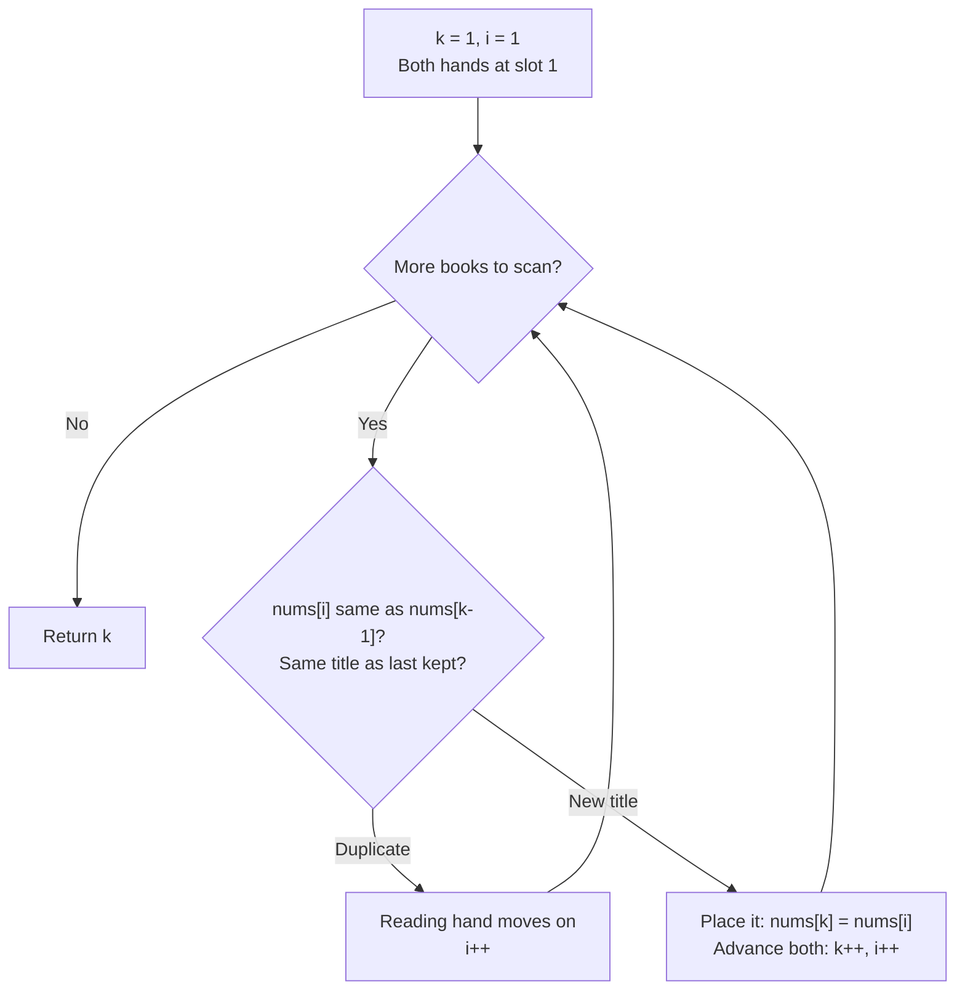

# Remove Duplicates from Sorted Array — Mental Model

## The Librarian's Shelf Analogy

Imagine you're a librarian reorganizing a shelf of books. The shelf is already sorted alphabetically by title, which means all copies of the same book sit together in a cluster. Your mission: create a clean section at the left of the shelf with exactly one copy of each title, then report how many unique titles you placed there.

You work with two hands. Your **writing hand** tracks the next available slot in the clean section. It starts at slot 1 — the very first book is trivially unique (nothing came before it), so slot 0 is already "placed." Your **reading hand** scans the shelf from slot 1 onward, picking up each book in sequence.

The rule is simple: when the reading hand picks up a book with the same title as the one just behind the writing hand, it's a duplicate — skip it, move the reading hand forward. When the reading hand finds a *different* title, hand it to the writing hand to place in the clean section, then advance both hands.

The sorted shelf gives you a powerful shortcut: since all copies of a title cluster together, you only ever need to compare against the book just behind the writing hand — the most recently placed unique title. You never need to look further back.

---

## Understanding the Analogy

### The Setup

You have a long shelf of sorted books. Some titles repeat: perhaps three copies of "Arrays", two copies of "Binary Trees", four copies of "Graphs". Your shelf might look like: `[Arrays, Arrays, Arrays, Binary Trees, Binary Trees, Graphs]`.

Your job is to compact the left side of the shelf so it holds only unique titles. You'll overwrite duplicate slots with unique books, sliding them forward. At the end, report how many titles occupy the clean section. You cannot use a second shelf — all work happens on the original shelf, in place.

### The Two Hands

The **writing hand** (`k`) marks the next available slot. It begins at slot 1 because slot 0 already holds the first book, which is always unique. As unique titles are discovered, the writing hand places each one and steps forward, always pointing to the next empty slot in the clean section.

The **reading hand** (`i`) starts at slot 1 and scans every book rightward, one by one. At each stop it checks: is this the same title as the book just behind the writing hand? If yes — duplicate, move on. If no — new title, alert the writing hand. The writing hand places it and advances.

The critical observation: the writing hand always stays *at or behind* the reading hand. The reading hand races ahead; the writing hand compacts from the left. They can never collide destructively — the writing hand only reaches a slot after the reading hand has already passed it.

### Why This Approach

A simpler approach might build a new collection from scratch: scan the shelf, collect unique titles in a fresh bin, report the count. That works but requires extra space proportional to the shelf size.

The two-hand technique avoids extra space because of one insight: **the sorted order guarantees duplicates are adjacent**. Once the writing hand places a title, all remaining copies appear consecutively in the reading hand's upcoming scan. We only need to watch for the moment a new, different title appears — and that moment is always detected by comparing against the last placed book.

### Simple Example Through the Analogy

Your shelf holds: `[Mystery, Mystery, Romance, Sci-Fi, Sci-Fi, Sci-Fi]`.

Both hands start at slot 1. The writing hand rests against "Mystery" (slot 0) as its reference.

Reading hand picks up "Mystery" at slot 1. Same title as last placed — duplicate, skip. Reading hand moves to slot 2.

Reading hand picks up "Romance" at slot 2. Different from last placed! Writing hand places "Romance" at slot 1 and advances to slot 2. Reading hand moves to slot 3.

Reading hand picks up "Sci-Fi" at slot 3. Different from last placed ("Romance")! Writing hand places "Sci-Fi" at slot 2 and advances to slot 3. Reading hand moves to slot 4.

Reading hand picks up "Sci-Fi" at slot 4. Same as last placed — duplicate, skip. Reading hand moves to slot 5.

Reading hand picks up "Sci-Fi" at slot 5. Same again — skip. Reading hand moves past the end. Done.

Writing hand stopped at slot 3 — the shelf now holds 3 unique titles.

Now you understand HOW to solve the problem. Let's build it step by step.

---

## How I Think Through This

I start with the observation that the array is sorted, so all duplicates are adjacent — that's the key property I exploit. I initialize `k` (the writing hand) to 1, since `nums[0]` is trivially the first unique element and already in place. Then I scan `i` (the reading hand) from index 1 to the end of the array. At each position, I compare `nums[i]` against `nums[k - 1]` — the most recently claimed unique value. If they differ, I've found a new title: I write it to `nums[k]` and increment `k`. If they're equal, it's a duplicate: I advance only `i`. The invariant that keeps everything correct is that `nums[k - 1]` always holds the last unique value placed, so comparing against it is always sufficient to catch a new title.

Tracing `[1, 1, 2, 2, 3]`:
- Setup: k=1, i=1. Clean section: `[1, ...]`
- i=1: nums[1]=1, nums[k-1]=nums[0]=1 → duplicate → i=2
- i=2: nums[2]=2, nums[k-1]=nums[0]=1 → new → nums[1]=2, k=2, i=3. Clean: `[1, 2, ...]`
- i=3: nums[3]=2, nums[k-1]=nums[1]=2 → duplicate → i=4
- i=4: nums[4]=3, nums[k-1]=nums[1]=2 → new → nums[2]=3, k=3, i=5. Clean: `[1, 2, 3, ...]`
- i=5: done → return k=3 ✓

---

## Building the Algorithm

### Step 1: The Two-Hand Sweep

The writing hand starts at slot 1 — slot 0 is already the first unique book. The reading hand scans from slot 1 onward. At each book, there are only two outcomes: same title as the last placed book (duplicate — skip), or a new title (place it and advance both hands).

The key detail: we compare `nums[i]` against `nums[k - 1]`, not `nums[k]`. The writing hand `k` points to the *next available slot*, so `k - 1` is the index of the book we just placed. Comparing against `nums[k - 1]` is what makes the sorted-array guarantee pay off — we always know what the "last kept title" is.



Here's the state of both hands processing `[1, 1, 2, 2, 3]`:

| Reading Hand (i) | nums[i] | Last Placed (nums[k-1]) | New Title? | Action | Writing Hand (k) |
|---|---|---|---|---|---|
| 1 | 1 | 1 | No  | skip      | 1 |
| 2 | 2 | 1 | Yes | write + k++ | 2 |
| 3 | 2 | 2 | No  | skip      | 2 |
| 4 | 3 | 2 | Yes | write + k++ | 3 |

```typescript
function removeDuplicates(nums: number[]): number {
  let k = 1; // writing hand: slot 0 is already kept

  for (let i = 1; i < nums.length; i++) {
    if (nums[i] !== nums[k - 1]) {
      nums[k] = nums[i]; // place the new title in the clean section
      k++;               // writing hand advances to the next available slot
    }
    // duplicate: only reading hand moves (implicit in for loop)
  }

  return k; // number of unique titles in the clean section
}
```

:::stackblitz{file="step1-problem.ts" step=1 total=1 solution="step1-solution.ts"}

---

## Tracing through an Example

Input: `[0, 0, 1, 1, 1, 2, 2, 3, 3, 4]`

| Step | Reading Hand (i) | nums[i] | Writing Hand (k) | Last Placed (nums[k-1]) | New Title? | Action | Clean Section |
|------|---|---|---|---|---|---|---|
| Start | 1 | 0 | 1 | nums[0] = 0 | — | initialize | `[0, ...]` |
| 1 | 1 | 0 | 1 | nums[0] = 0 | No | skip | `[0, ...]` |
| 2 | 2 | 1 | 1 | nums[0] = 0 | Yes | write + k++ | `[0, 1, ...]` |
| 3 | 3 | 1 | 2 | nums[1] = 1 | No | skip | `[0, 1, ...]` |
| 4 | 4 | 1 | 2 | nums[1] = 1 | No | skip | `[0, 1, ...]` |
| 5 | 5 | 2 | 2 | nums[1] = 1 | Yes | write + k++ | `[0, 1, 2, ...]` |
| 6 | 6 | 2 | 3 | nums[2] = 2 | No | skip | `[0, 1, 2, ...]` |
| 7 | 7 | 3 | 3 | nums[2] = 2 | Yes | write + k++ | `[0, 1, 2, 3, ...]` |
| 8 | 8 | 3 | 4 | nums[3] = 3 | No | skip | `[0, 1, 2, 3, ...]` |
| 9 | 9 | 4 | 4 | nums[3] = 3 | Yes | write + k++ | `[0, 1, 2, 3, 4]` |
| Done | — | — | **5** | — | — | return 5 | `[0, 1, 2, 3, 4]` |

---

## Common Misconceptions

**"I need to compare nums[i] against everything already in the clean section, not just the last book."** — Because the shelf is sorted, duplicates always cluster. If a book matches anything in the clean section, it *must* match the book directly behind the writing hand — the last placed title. There's no need to look further back.

**"The writing hand should start at slot 0."** — Slot 0 already holds the first book, which is always unique by definition. Starting `k` at 0 would leave the writing hand pointing at a filled slot, causing the first unique book found to overwrite position 0 (itself) and the count to be off by one. Starting at 1 means slot 0 is pre-claimed and `k` is ready for the next new title.

**"After the function returns, nums only contains k elements."** — The shelf still has its full original length. Only the first `k` slots hold meaningful unique titles; the remaining slots contain leftover stale values from before. The return value `k` tells you *how far to read* — not how long the shelf became.

**"I should write first, then compare."** — You must compare first to decide *whether* to write. Writing unconditionally would place every book in the clean section — including duplicates — and nums[k-1] would always equal nums[i] on the very next step, breaking the detection logic entirely.

---

## Complete Solution

:::stackblitz{file="solution.ts" step=1 total=1 solution="solution.ts"}
