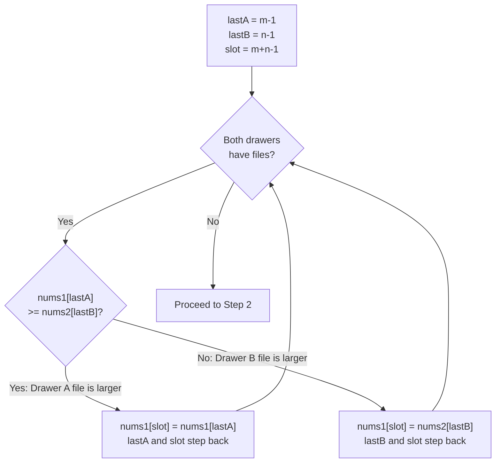

# Merge Sorted Array — Mental Model

## The Filing Drawer Analogy

Imagine you're an archivist with two sorted filing drawers. Drawer A holds numbered folders in order — say folders 3, 7, and 12 — but it also has empty hanging slots at the back, reserved for Drawer B's contents. Drawer B holds its own sorted folders: 2, 5, and 9. Your task is to merge both drawers into a single sorted drawer, using only Drawer A's space.

The naive approach — starting from the front and inserting Drawer B's smallest folders one by one — fails immediately. To place Drawer B's smallest folder before Drawer A's existing files, you'd have to shift all of Drawer A's contents rightward. But shifting rightward means overwriting the empty reserved slots you need. Chaos ensues before you've even placed the first file.

The insight is to flip your perspective: **start from the back.** The last empty slot in Drawer A should hold the largest folder from either source. You can find that by comparing the current last folder in Drawer A's real section against the current last folder in Drawer B. Place the larger one in the last empty slot, then step both that drawer's marker and the fill-slot marker one position backward. Repeat until one drawer runs out.

When Drawer B empties first, any remaining Drawer A files are already sitting in exactly the right positions — no copying needed. When Drawer A empties first, Drawer B still has small files that haven't been placed; simply copy them forward into the remaining front slots. Either way, the empty reserved space absorbs every file placed from the back without ever colliding with files you still need.

---

## Understanding the Analogy

### The Setup

You have two sorted drawers of numbered folders, where smaller numbers sit toward the front of each drawer. Drawer A has `m` real folders followed by `n` empty reserved slots — total length `m + n`. Drawer B has exactly `n` folders and no empty slots. Your job: fill all `m + n` positions of Drawer A with the combined folders in sorted order. You cannot use a second work surface — everything must happen within Drawer A's existing space.

### The Three File Markers

You place three sticky-note markers to guide your work:

**Last-A marker** — you slide it to the back of Drawer A's real section (position `m − 1`). This marks the highest-numbered real folder currently in Drawer A. As you pull files from Drawer A to place them, this marker steps one slot forward toward the front.

**Last-B marker** — you slide it to the back of Drawer B (position `n − 1`). This marks the highest-numbered folder in Drawer B. As you pull files from Drawer B, this marker steps forward as well.

**Slot marker** — you slide it to the very last position in Drawer A (position `m + n − 1`). This is the next slot to fill. It starts at the back and steps forward with every file you place.

The slot marker always moves into space you have already filled or space that was always empty. It can never catch up with Last-A as long as both drawers are non-empty, because each placement step moves both the slot marker and whichever drawer-marker was used — they stay synchronized. This is the geometric guarantee that makes the in-place merge safe.

### Why This Approach

If you tried to merge left-to-right, placing the smallest available folder at each position, you would immediately overwrite Drawer A's real files before comparing them. You would need a second temporary drawer — extra space proportional to the input size — to hold displaced files.

Going right-to-left costs no extra space. The reserved empty slots act as the working area. Because both source sections are already sorted, the largest unplaced folder from either drawer is always at the back of that drawer's remaining section — exactly where your markers point. You never need to scan backward or forward; the next comparison and placement is always O(1).

### Simple Example Through the Analogy

Drawer A holds folders 1, 3, 5 followed by three empty reserved slots. Drawer B holds folders 2, 4, 6. Last-A points to folder 5, Last-B points to folder 6, Slot points to the rightmost empty slot.

Comparison 1: Folder 5 vs Folder 6. Folder 6 is larger. Place Folder 6 in the last slot. Move Last-B back to folder 4; move Slot back one.

Comparison 2: Folder 5 vs Folder 4. Folder 5 is larger. Place Folder 5 in the now-last open slot. Move Last-A back to folder 3; move Slot back.

Comparison 3: Folder 3 vs Folder 4. Folder 4 is larger. Place Folder 4. Move Last-B back to folder 2; move Slot back.

Comparison 4: Folder 3 vs Folder 2. Folder 3 is larger. Place Folder 3. Move Last-A back to folder 1; move Slot back.

Comparison 5: Folder 1 vs Folder 2. Folder 2 is larger. Place Folder 2. Last-B is now empty; move Slot back.

No drawer-B folders remain. Folder 1 is already sitting at position 0 — exactly right. Done.

Now you understand HOW to solve the problem. Let's build it step by step.

---

## How I Think Through This

I look at this as a three-marker fill-from-back problem. I set `lastA = m − 1` (the last real folder in Drawer A), `lastB = n − 1` (the last folder in Drawer B), and `slot = m + n − 1` (the last position in Drawer A). The core rule is: while both drawers still have files, compare `nums1[lastA]` against `nums2[lastB]`, write the larger value to `nums1[slot]`, and step both the used-drawer marker and `slot` backward by one. This invariant — always placing the largest remaining file at the furthest unfilled slot — guarantees sorted order because every file placed is larger than all files not yet placed. After the main loop ends, if `lastB` is still non-negative, Drawer B has leftover files that are all smaller than anything placed so far; I copy them into the front of Drawer A one by one. If it's `lastA` that's still non-negative, those Drawer A files are already in their correct positions and need no action.

Tracing `nums1 = [1, 3, 5, 0, 0, 0], m = 3, nums2 = [2, 4, 6], n = 3`:
- Setup: lastA=2, lastB=2, slot=5. Drawer A real section: `[1, 3, 5]`
- slot 5: 5 < 6 → place 6 at slot 5. lastB=1, slot=4. Drawer: `[1,3,5, _, _, 6]`
- slot 4: 5 > 4 → place 5 at slot 4. lastA=1, slot=3. Drawer: `[1,3,5, _, 5, 6]`
- slot 3: 3 < 4 → place 4 at slot 3. lastB=0, slot=2. Drawer: `[1,3,5, 4, 5, 6]`
- slot 2: 3 > 2 → place 3 at slot 2. lastA=0, slot=1. Drawer: `[1,3,3, 4, 5, 6]`
- slot 1: 1 < 2 → place 2 at slot 1. lastB=-1, slot=0. Drawer: `[1,2,3, 4, 5, 6]`
- Loop ends (lastB < 0). Second while: lastB=-1, skip. nums1[0]=1 already correct. → `[1,2,3,4,5,6]` ✓

---

## Building the Algorithm

Each step introduces one concept from the Filing Drawer analogy, then a StackBlitz embed to try it.

### Step 1: Deal from the Back — The Three-Marker Comparison Loop

The first concept is the backwards fill. Place three markers at their starting positions: `lastA` at the back of Drawer A's real section, `lastB` at the back of Drawer B, and `slot` at the very last position in Drawer A. Then run the comparison loop: while both drawers have files, compare the file at each drawer's marker, place the larger one at `slot`, and step the used marker and `slot` backward.

Notice the comparison uses `>=` — when files have equal numbers, we take Drawer A's file first. This is arbitrary (either is correct), but consistently taking Drawer A avoids an unnecessary write: we're already placing `nums1[lastA]` back into `nums1[slot]`, and in a tie that's the same value either way.



Here's what the three markers look like tracing `nums1=[1,3,5,0,0,0], m=3, nums2=[6,7,8], n=3`:

| Slot | Last-A file | Last-B file | Larger | Action | Drawer A state |
|------|------------|------------|--------|--------|----------------|
| 5 | 5 | 8 | B | place 8 at 5 | `[1,3,5,_,_,8]` |
| 4 | 5 | 7 | B | place 7 at 4 | `[1,3,5,_,7,8]` |
| 3 | 5 | 6 | B | place 6 at 3 | `[1,3,5,6,7,8]` |
| — | lastB=-1 | — | loop ends | — | `[1,3,5,6,7,8]` ✓ |

```typescript
function merge(nums1: number[], m: number, nums2: number[], n: number): void {
  let lastA = m - 1;       // Last-A marker: back of Drawer A's real section
  let lastB = n - 1;       // Last-B marker: back of Drawer B
  let slot = m + n - 1;    // Slot marker: back of Drawer A (next slot to fill)

  // While both drawers have files: compare and place the larger one from the back
  while (lastA >= 0 && lastB >= 0) {
    if (nums1[lastA] >= nums2[lastB]) {
      nums1[slot--] = nums1[lastA--]; // Drawer A file goes to the current slot
    } else {
      nums1[slot--] = nums2[lastB--]; // Drawer B file goes to the current slot
    }
  }
}
```

:::stackblitz{file="step1-problem.ts" step=1 total=2 solution="step1-solution.ts"}

### Step 2: File the Remaining Drawer B Documents

When the main loop ends, one of two things happened: Drawer B ran out first, or Drawer A ran out first.

**If Drawer B ran out first** (`lastB < 0`): any remaining Drawer A files sit in exactly the right positions. File 1 at index 0 is already at index 0 — nothing to copy. The merge is complete.

**If Drawer A ran out first** (`lastA < 0`): Drawer B still holds files that are all smaller than every file already placed (otherwise they would have been placed by now). Copy them directly into the remaining front slots of Drawer A. The `slot` marker tells you exactly where to place each one.

There is no third case to handle — no "remaining Drawer A" copy loop is needed. This asymmetry is the elegant payoff of choosing Drawer A as the output.

```typescript
  // After the main loop: copy any leftover Drawer B files
  // (leftover Drawer A files are already in the correct positions — no action needed)
  while (lastB >= 0) {
    nums1[slot--] = nums2[lastB--]; // Drop Drawer B's remaining files into the front slots
  }
```

The full two-step solution:

```typescript
function merge(nums1: number[], m: number, nums2: number[], n: number): void {
  let lastA = m - 1;
  let lastB = n - 1;
  let slot = m + n - 1;

  while (lastA >= 0 && lastB >= 0) {
    if (nums1[lastA] >= nums2[lastB]) {
      nums1[slot--] = nums1[lastA--];
    } else {
      nums1[slot--] = nums2[lastB--];
    }
  }

  while (lastB >= 0) {
    nums1[slot--] = nums2[lastB--];
  }
}
```

:::stackblitz{file="step2-problem.ts" step=2 total=2 solution="step2-solution.ts"}

---

## Tracing through an Example

Input: `nums1 = [1, 2, 3, 0, 0, 0], m = 3, nums2 = [2, 5, 6], n = 3`

| Step | Last-A Marker (lastA) | Drawer A file | Last-B Marker (lastB) | Drawer B file | Larger? | Action | Drawer A state |
|------|----------------------|--------------|----------------------|--------------|---------|--------|----------------|
| Start | 2 | 3 | 2 | 6 | — | initialize | `[1,2,3,0,0,0]` |
| 1 | 2 | 3 | 2 | 6 | B | place 6 at slot 5, lastB=1, slot=4 | `[1,2,3,0,0,6]` |
| 2 | 2 | 3 | 1 | 5 | B | place 5 at slot 4, lastB=0, slot=3 | `[1,2,3,0,5,6]` |
| 3 | 2 | 3 | 0 | 2 | A | place 3 at slot 3, lastA=1, slot=2 | `[1,2,3,3,5,6]` |
| 4 | 1 | 2 | 0 | 2 | A (tie) | place 2(A) at slot 2, lastA=0, slot=1 | `[1,2,2,3,5,6]` |
| 5 | 0 | 1 | 0 | 2 | B | place 2(B) at slot 1, lastB=-1, slot=0 | `[1,2,2,3,5,6]` |
| Done | 0 | 1 | -1 | — | — | lastB<0, loop ends; lastA=0 in place | `[1,2,2,3,5,6]` ✓ |

---

## Common Misconceptions

**"I should merge from the front, placing the smaller file at each position."** — From the front, the first position Drawer B wants to fill is `nums1[0]`, but that slot already holds a real Drawer A file. Placing Drawer B's smallest file there overwrites the Drawer A file you still need to compare. You'd need a temporary drawer to hold displaced files — extra space proportional to m. The backward merge sidesteps this entirely by filling only slots that are empty or already finalized.

**"After the main loop, I need to copy the remaining Drawer A files into their new positions."** — Drawer A's remaining files are already in `nums1`, already at the correct indices. If Drawer A still has files when Drawer B runs out, those files are all smaller than every file already placed (they would have been placed otherwise). Since the output is also `nums1`, nothing has moved — they simply stay where they are. Only Drawer B's files were in a separate array (`nums2`) and actually need copying.

**"The equal-files case has to go to Drawer B, not Drawer A."** — Either is correct, and the result will be the same sorted array. The convention of taking Drawer A first (`>=`) is a minor style choice. Choosing Drawer B (`>` with else taking Drawer A) produces the same final merged array, just with the two equal files in the opposite relative order — both valid since the problem only asks for sorted order, not stable sort.

**"I need a third while loop to handle the remaining Drawer A files."** — There are only two possible post-loop states: Drawer B still has files (copy them forward), or Drawer B is empty (Drawer A files are already in place). A third `while (lastA >= 0)` loop would run correctly — it would just do nothing useful, since `nums1[slot--] = nums1[lastA--]` copies a value to itself (same array, and `slot` and `lastA` advance together). It's harmless but unnecessary.

**"This approach requires m > 0 to work."** — When `m = 0`, `lastA` starts at `-1`, the main while loop never executes, and the second while loop copies all of Drawer B into the front of Drawer A. The edge case handles itself naturally — no special-casing needed.

---

## Complete Solution

:::stackblitz{file="solution.ts" step=2 total=2 solution="solution.ts"}
