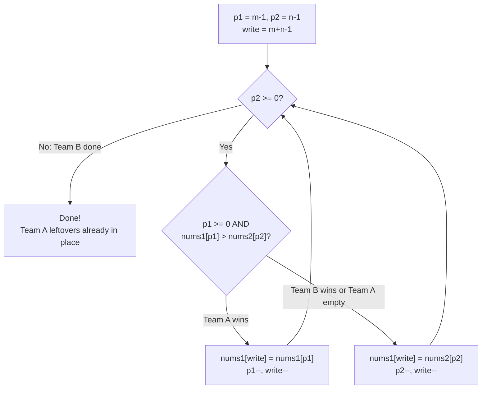

# Merge Sorted Array - Mental Model

## The Problem

You are given two integer arrays `nums1` and `nums2`, sorted in non-decreasing order, and two integers `m` and `n`, representing the number of elements in `nums1` and `nums2` respectively. Merge `nums1` and `nums2` into a single array sorted in non-decreasing order. The final sorted array should not be returned by the function, but instead be stored inside the array `nums1`. To accommodate this, `nums1` has a length of `m + n`, where the first `m` elements denote the elements that should be merged, and the last `n` elements are set to `0` and should be ignored. `nums2` has a length of `n`.

**Example 1:**
```
Input: nums1 = [1,2,3,0,0,0], m = 3, nums2 = [2,5,6], n = 3
Output: [1,2,2,3,5,6]
```

**Example 2:**
```
Input: nums1 = [1], m = 1, nums2 = [], n = 0
Output: [1]
```

**Example 3:**
```
Input: nums1 = [0], m = 0, nums2 = [1], n = 1
Output: [1]
```

---

## The Trophy Display Merger Analogy

Imagine a sports arena with two trophy display shelves — one for Team A, one for Team B. Both shelves are arranged identically: trophies sorted from shortest on the left to tallest on the right. The arena needs to consolidate them into one unified display on Team A's shelf, which conveniently has empty pedestals on the right reserved for the additional trophies.

The curator's insight: start from the rightmost pedestal and work backward. She places an **A-marker** at Team A's last real trophy, a **B-marker** at Team B's last trophy, and a **write marker** at the rightmost empty pedestal. Then she compares the two trophies at the markers — whichever is taller goes to the write pedestal. That marker moves left, and the write marker advances to the next pedestal. She fills from tallest to shortest, right to left.

The key is direction. By filling from the right, the curator writes into pedestals that are either empty or already claimed — the write marker never catches up to the A-marker. Team A's trophies are safe to read because the write marker always stays ahead of them.

When Team B's shelf is empty (the B-marker falls off the left), the process stops. Any remaining Team A trophies are already exactly where they belong — they were already on Team A's shelf and never needed to move.

---

## Understanding the Analogy

### The Setup

Team A's shelf holds `m` real trophies followed by `n` empty pedestals. Team B's shelf holds `n` trophies. Both shelves are sorted shortest to tallest. The task: rearrange Team A's shelf so it holds all `m + n` trophies in sorted order — without borrowing a third shelf.

The `n` empty pedestals at the right end of Team A's shelf are the workspace. They're there on purpose, reserved for this merger.

### The Three Markers

Three markers drive the entire operation:

- **The A-marker** (`p1`) starts at the rightmost real trophy on Team A's shelf — position `m - 1`. It tracks which of Team A's trophies hasn't been placed yet.
- **The B-marker** (`p2`) starts at the rightmost trophy on Team B's shelf — position `n - 1`. It tracks which of Team B's trophies hasn't been placed yet.
- **The write marker** (`write`) starts at the very last pedestal on Team A's shelf — position `m + n - 1`. This is where the next trophy goes.

All three markers only move left. The write marker steps left with every placement. The A-marker steps left only when a Team A trophy is placed; the B-marker only when a Team B trophy is placed.

The critical safety guarantee: at the start, write and p1 are exactly `n` positions apart (write = m+n-1, p1 = m-1, gap = n). Each step, write moves left by 1 and either p1 also moves left (gap stays the same) or p2 does (gap grows). The gap never shrinks — the write marker can never overtake the A-marker and overwrite a trophy you haven't read yet.

### Why This Approach

If you tried to fill from the left, every time you placed a Team B trophy at the front, you'd have to shift Team A's existing trophies rightward to make room. That's O(n) shifting per insertion — the whole merge becomes O(n²).

The right-to-left approach uses the empty space that's already there. The write marker fills exactly those empty pedestals first, then slots that Team A trophies have already vacated. No shifting ever needed. Every placement is O(1), and you make exactly `m + n` placements total.

### Simple Example Through the Analogy

Team A's shelf: `[1, 2, 3, _, _, _]` — 3 real trophies, 3 reserved pedestals.
Team B's shelf: `[2, 5, 6]` — 3 trophies.

A-marker at 3 (Team A's tallest). B-marker at 6 (Team B's tallest). Write marker at the last pedestal (slot 5).

**Round 1**: Compare 3 vs 6. Team B wins — place 6 at slot 5. B-marker moves left to 5. Write marker moves to slot 4.

**Round 2**: Compare 3 vs 5. Team B wins again — place 5 at slot 4. B-marker moves to 2. Write marker moves to slot 3.

**Round 3**: Compare 3 vs 2. Team A wins — place 3 at slot 3. A-marker moves left to 2. Write marker moves to slot 2.

**Round 4**: Compare 2 vs 2. Tie — place Team B's 2 at slot 2. B-marker moves off the left end. Loop stops.

Team A's shelf now reads `[1, 2, 2, 3, 5, 6]`. The remaining Trophy 1 and Trophy 2 from Team A were already in their correct positions — they never needed to move.

Now you understand HOW to solve the problem. Let's build it step by step.

---

## How I Think Through This

I start by noting that we're merging two sorted arrays in-place into nums1, which has exactly enough space for all elements. The key realization: if I work left to right I'd need to shift things — so I work right to left, filling the largest slot first. I set up three variables: `p1 = m - 1` (the A-marker at Team A's last real trophy), `p2 = n - 1` (the B-marker at Team B's last trophy), and `write = m + n - 1` (the write marker at the last pedestal). I loop as long as `p2 >= 0` — once Team B's shelf is empty, any remaining Team A trophies are already in place and don't need to move. Each iteration I compare `nums1[p1]` and `nums2[p2]` and place the larger at `nums1[write]`, decrementing that marker and write. The `p1 >= 0` guard handles the case where Team A's real section runs out before Team B does.

Take `nums1 = [1, 2, 3, 0, 0, 0]`, `m = 3`, `nums2 = [2, 5, 6]`, `n = 3`:

- Setup: `p1 = 2`, `p2 = 2`, `write = 5`
- `nums1[2]=3` vs `nums2[2]=6`: 6 wins → place 6 at index 5; `p2=1`, `write=4`
- `nums1[2]=3` vs `nums2[1]=5`: 5 wins → place 5 at index 4; `p2=0`, `write=3`
- `nums1[2]=3` vs `nums2[0]=2`: 3 wins → place 3 at index 3; `p1=1`, `write=2`
- `nums1[1]=2` vs `nums2[0]=2`: tie → place nums2's 2 at index 2; `p2=-1`, `write=1`
- `p2 < 0`: loop ends. `nums1 = [1, 2, 2, 3, 5, 6]` ✓

---

## Building the Algorithm

Each step introduces one concept from the Trophy Display Merger, then a StackBlitz embed to try it.

### Step 1: Place the Three Markers

Before touching any trophy, the curator places her markers. We handle the simplest case first: if Team B's shelf is empty (`n === 0`), there's nothing to merge — return immediately. Otherwise, we set up the three starting positions.

```typescript
function merge(nums1: number[], m: number, nums2: number[], n: number): void {
  // If Team B's shelf is empty, no merging needed
  if (n === 0) return;

  // Three markers: last real trophy in Team A, last in Team B, last pedestal
  let p1 = m - 1;
  let p2 = n - 1;
  let write = m + n - 1;

  // (filling loop comes next)
}
```

:::stackblitz{file="step1-problem.ts" step=1 total=2 solution="step1-solution.ts"}

### Step 2: Fill from the Right

Now the curator works backward. As long as Team B has trophies remaining (`p2 >= 0`), compare the current tallest from each team and place the winner at the write pedestal. The `p1 >= 0` guard handles the case where Team A's real section runs out first — when `p1 < 0`, there are no more Team A trophies to compare, so we always take from Team B.

When `p2` drops below zero, the loop stops. Any remaining Team A trophies are already in their correct positions.



```typescript
while (p2 >= 0) {
  if (p1 >= 0 && nums1[p1] > nums2[p2]) {
    // Team A's trophy is taller — move it to the write pedestal
    nums1[write] = nums1[p1];
    p1--;
  } else {
    // Team B's trophy wins (or Team A is exhausted) — place Team B's
    nums1[write] = nums2[p2];
    p2--;
  }
  write--; // write marker always steps left
}
```

:::stackblitz{file="step2-problem.ts" step=2 total=2 solution="step2-solution.ts"}

---

## Tracing through an Example

Input: `nums1 = [1, 2, 3, 0, 0, 0]`, `m = 3`, `nums2 = [2, 5, 6]`, `n = 3`

| Step | A-Marker (p1) | Team A Trophy | B-Marker (p2) | Team B Trophy | Team A Wins? | Action | nums1 State |
|------|--------------|---------------|--------------|---------------|-------------|--------|-------------|
| Start | 2 | 3 | 2 | 6 | — | initialize markers | [1, 2, 3, 0, 0, 0] |
| write=5 | 2 | 3 | 2 | 6 | No (3 < 6) | place 6 at [5]; p2=1, write=4 | [1, 2, 3, 0, 0, 6] |
| write=4 | 2 | 3 | 1 | 5 | No (3 < 5) | place 5 at [4]; p2=0, write=3 | [1, 2, 3, 0, 5, 6] |
| write=3 | 2 | 3 | 0 | 2 | Yes (3 > 2) | place 3 at [3]; p1=1, write=2 | [1, 2, 3, 3, 5, 6] |
| write=2 | 1 | 2 | 0 | 2 | No (tie) | place 2 at [2]; p2=-1, write=1 | [1, 2, 2, 3, 5, 6] |
| Done | 1 | 2 | -1 | — | — | p2 < 0, loop ends | [1, 2, 2, 3, 5, 6] |

---

## Common Misconceptions

**"I need to copy leftover Team A trophies after the loop"** — When `p2` drops below zero, any remaining Team A trophies are exactly where they belong. They were already in nums1 at positions 0 through p1, and since we filled from the right, we never touched them. Only Team B's trophies actually need to be moved — Team A's are already home.

**"The write marker could overwrite a Team A trophy I haven't read yet"** — This can't happen. At the start, write and p1 are exactly `n` positions apart. Each step, write moves left by 1; either p1 also moves left by 1 (gap stays constant) or p2 moves instead (gap grows). The gap never shrinks below `n - number-of-B-placements-so-far`, which stays non-negative. The write marker never catches the A-marker.

**"I should loop while p1 >= 0 OR p2 >= 0"** — Only loop while `p2 >= 0`. Team A's remaining trophies are already in nums1 at the right relative positions — writing them back to where they already sit wastes time and is error-prone. The loop ends precisely when Team B is exhausted.

**"On a tie, I must place Team A's trophy"** — Either works. Taking Team B's trophy on ties is slightly cleaner: when the loop ends, you've guaranteed all of Team B is placed, and Team A's remainder is untouched. But the values are equal, so correctness holds either way.

**"This only works for arrays of the exact right sizes"** — Correct, and that's the problem's guarantee: nums1 has exactly `m + n` slots (`m` real values plus `n` zeros). The safety invariant that write never overtakes p1 relies on that exact `n`-slot buffer. Don't attempt this pattern on an undersized array.

---

## Complete Solution

:::stackblitz{file="solution.ts" step=2 total=2 solution="solution.ts"}
